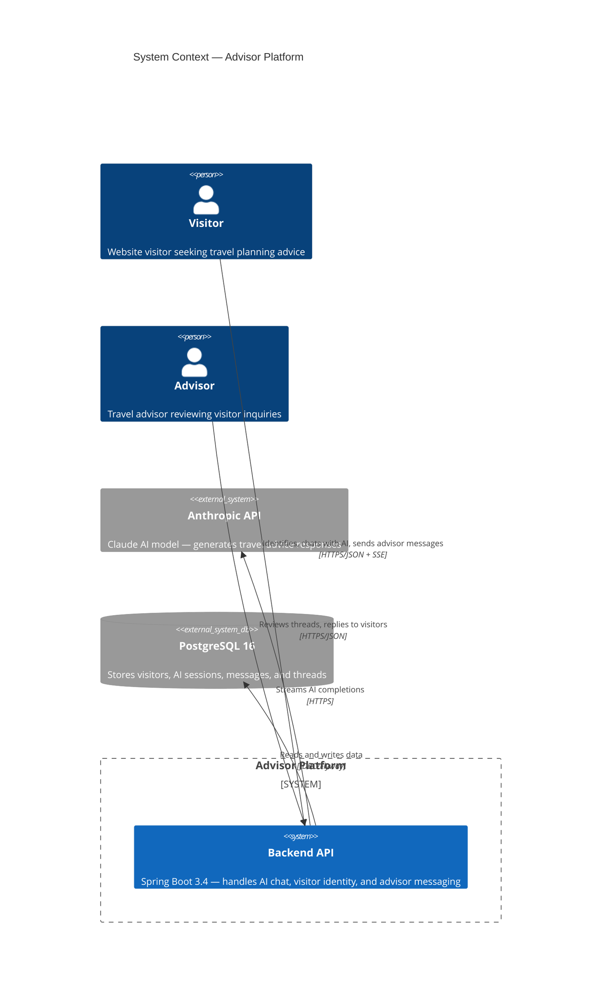
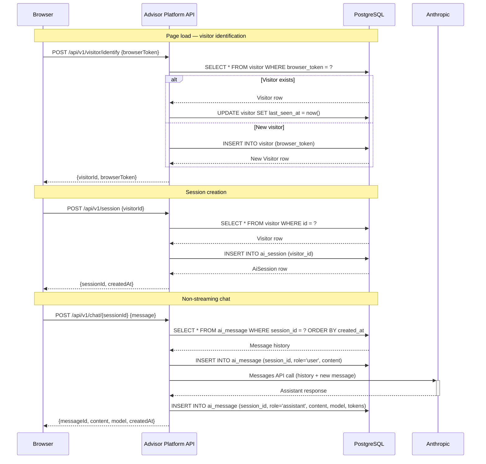
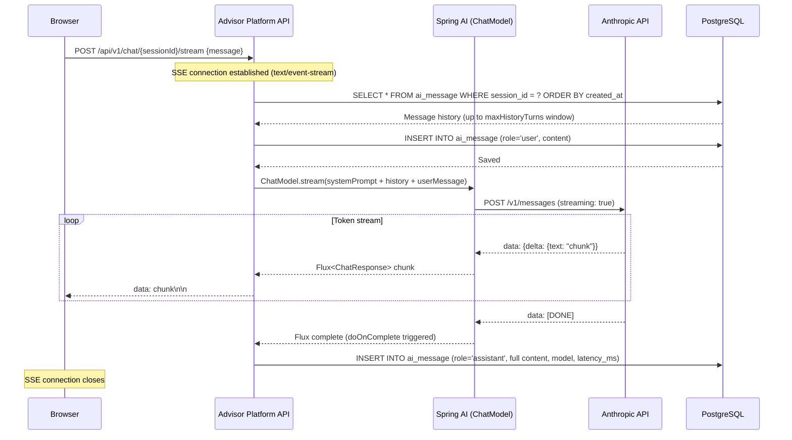
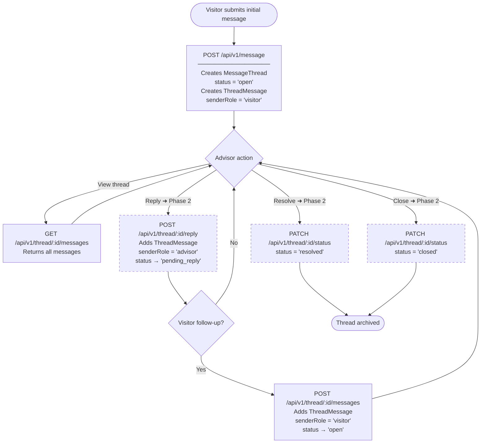
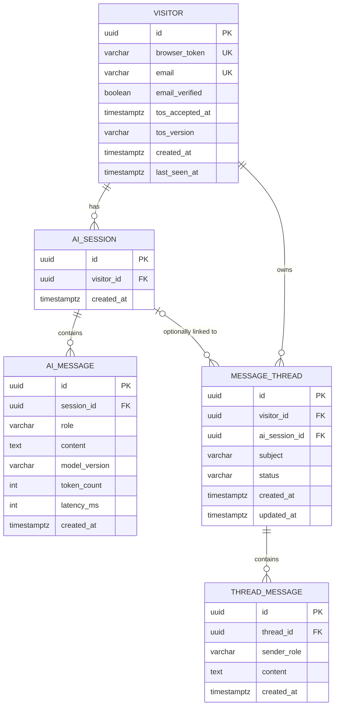

# Advisor Platform — Architecture

This document is the entry point for understanding the system. It contains the high-level context diagram, links to detailed sequence and flow diagrams, and links to Architecture Decision Records (ADRs).

---

## System Context



---

## Visitor Identity + Session Flow



---

## AI Streaming Pipeline



---

## Message Threading Workflow

> Dashed nodes indicate Phase 2 endpoints not yet implemented.



---

## Entity Relationships



---

## Architecture Decision Records

| ADR | Decision |
|---|---|
| [ADR-001](architecture/ADR-001-session-identity.md) | Session identity: browser token + find-or-create instead of authenticated users |
| [ADR-002](architecture/ADR-002-ai-streaming.md) | AI streaming: SSE with post-stream persistence |
| [ADR-003](architecture/ADR-003-message-threading.md) | Message threading: separate from AI sessions, visitor/advisor role model |

---

## Package Structure

```
src/main/java/com/advisorplatform/
├── api/           ApiDelegate implementations (HTTP layer)
├── service/       Business logic and orchestration
├── domain/
│   ├── entity/    JPA entities
│   └── repository/ Spring Data repositories
├── ai/            Spring AI + Anthropic integration
└── config/        Spring configuration beans

src/main/resources/api/   OpenAPI 3 spec files (one per domain, versioned)
target/generated-sources/ Generated Spring interfaces + POJOs — do not edit
```

---

## Maintenance

When a PR changes the API surface or database schema, update the relevant diagram and/or ADR as part of the same PR.
