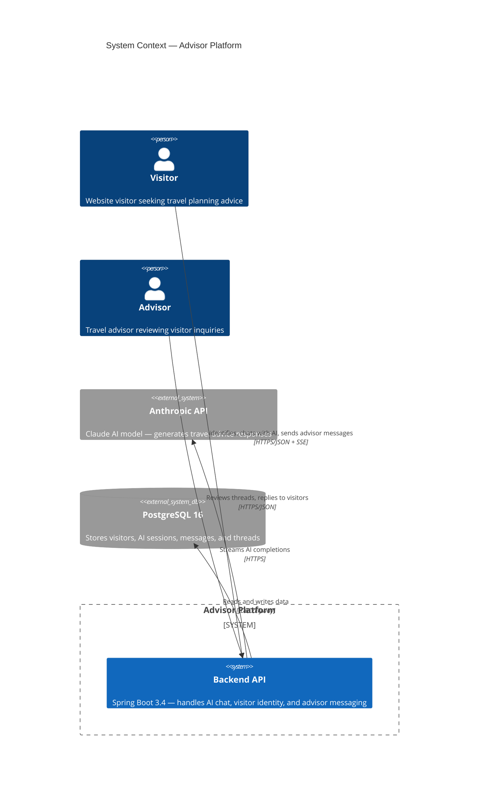
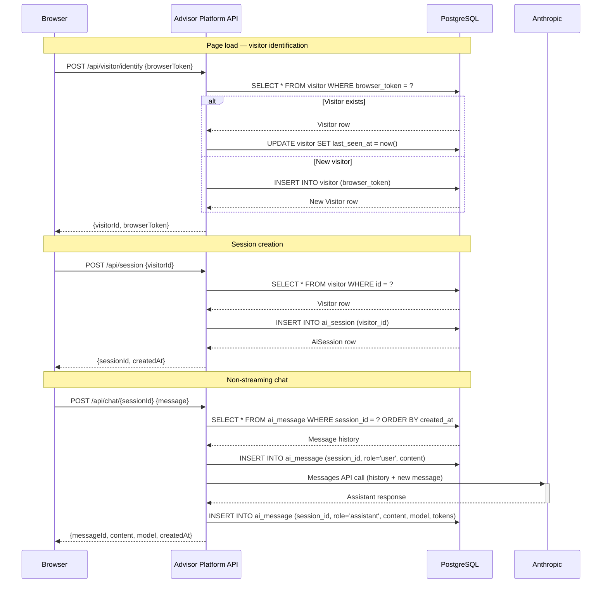
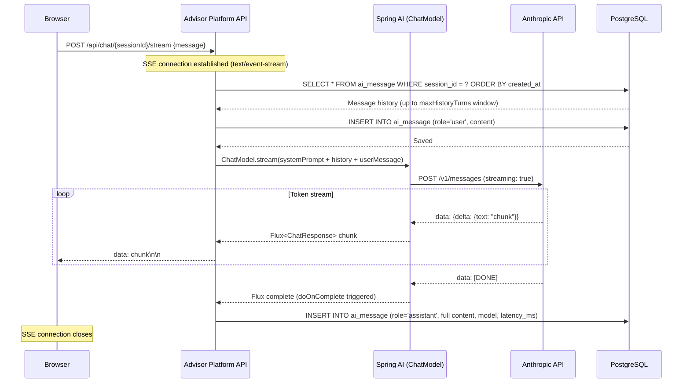
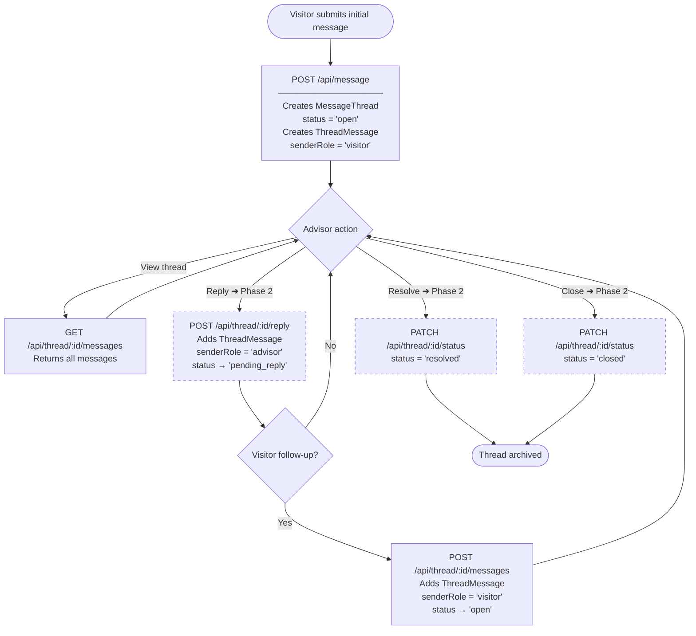
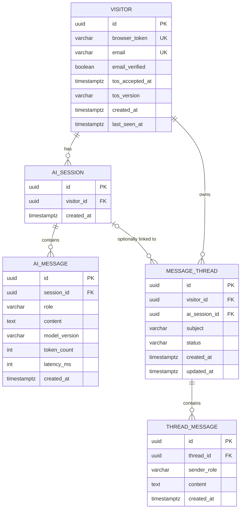

# Architecture Documentation — Implementation Plan

> **For agentic workers:** REQUIRED SUB-SKILL: Use superpowers:subagent-driven-development (recommended) or superpowers:executing-plans to implement this plan task-by-task. Steps use checkbox (`- [ ]`) syntax for tracking.

**Goal:** Create Mermaid-based architecture diagrams and lightweight ADRs that serve as onboarding reference, design review aid, and living documentation.

**Architecture:** All diagrams are Mermaid code blocks embedded inline in `docs/ARCHITECTURE.md` so they render natively on GitHub without extra tooling. Separate `.mmd` source files in `docs/architecture/diagrams/` are kept for editor tooling. ADRs follow a lightweight Status/Context/Decision/Consequences format.

**Tech Stack:** Mermaid (GitHub-native rendering), Markdown.

---

## File Map

**Create:**
- `docs/ARCHITECTURE.md`
- `docs/architecture/diagrams/c4-context.mmd`
- `docs/architecture/diagrams/visitor-session-flow.mmd`
- `docs/architecture/diagrams/ai-streaming-pipeline.mmd`
- `docs/architecture/diagrams/message-threading-workflow.mmd`
- `docs/architecture/diagrams/entity-relationships.mmd`
- `docs/architecture/ADR-001-session-identity.md`
- `docs/architecture/ADR-002-ai-streaming.md`
- `docs/architecture/ADR-003-message-threading.md`

---

## Task 1: C4 Context Diagram + ARCHITECTURE.md Entry Point

**Files:**
- Create: `docs/architecture/diagrams/c4-context.mmd`
- Create: `docs/ARCHITECTURE.md` (initial version — more diagrams added in later tasks)

- [ ] **Step 1: Create `docs/architecture/diagrams/c4-context.mmd`**

```
C4Context
    title System Context — Advisor Platform

    Person(visitor, "Visitor", "Website visitor seeking travel planning advice")
    Person(advisor, "Advisor", "Travel advisor reviewing visitor inquiries")

    System_Boundary(platform, "Advisor Platform") {
        System(api, "Backend API", "Spring Boot 3.4 — handles AI chat, visitor identity, and advisor messaging")
    }

    System_Ext(anthropic, "Anthropic API", "Claude AI model — generates travel advice responses")
    SystemDb_Ext(postgres, "PostgreSQL 16", "Stores visitors, AI sessions, messages, and threads")

    Rel(visitor, api, "Identifies, chats with AI, sends advisor messages", "HTTPS/JSON + SSE")
    Rel(advisor, api, "Reviews threads, replies to visitors", "HTTPS/JSON")
    Rel(api, anthropic, "Streams AI completions", "HTTPS")
    Rel(api, postgres, "Reads and writes data", "JDBC/Flyway")
```

- [ ] **Step 2: Create `docs/ARCHITECTURE.md` with the C4 diagram and table of contents**

```markdown
# Advisor Platform — Architecture

This document is the entry point for understanding the system. It contains the high-level context diagram, links to detailed sequence and flow diagrams, and links to Architecture Decision Records (ADRs).

---

## System Context



---

## Diagrams

| Diagram | What It Shows |
|---|---|
| [Visitor Identity + Session Flow](architecture/diagrams/visitor-session-flow.mmd) | How a visitor is identified on page load, sessions created, and AI chat initiated |
| [AI Streaming Pipeline](architecture/diagrams/ai-streaming-pipeline.mmd) | How SSE streaming chat flows through Spring AI to Anthropic and back, with persistence |
| [Message Threading Workflow](architecture/diagrams/message-threading-workflow.mmd) | Thread state machine from visitor submission through advisor reply |
| [Entity Relationships](architecture/diagrams/entity-relationships.mmd) | All 5 entities and their FK relationships |

---

## Architecture Decision Records

| ADR | Decision |
|---|---|
| [ADR-001](architecture/ADR-001-session-identity.md) | Session identity: browser token + find-or-create instead of authenticated users |
| [ADR-002](architecture/ADR-002-ai-streaming.md) | AI streaming: SSE with post-stream persistence |
| [ADR-003](architecture/ADR-003-message-threading.md) | Message threading: separate from AI sessions, visitor/advisor role model |

---

## Package Structure

```
src/main/java/com/advisorplatform/
├── api/           ApiDelegate implementations (HTTP layer)
├── service/       Business logic and orchestration
├── domain/
│   ├── entity/    JPA entities
│   └── repository/ Spring Data repositories
├── ai/            Spring AI + Anthropic integration
└── config/        Spring configuration beans

src/main/resources/api/   OpenAPI 3 spec files (one per domain)
target/generated-sources/ Generated Spring interfaces + POJOs — do not edit
```

---

## Maintenance

When a PR changes the API surface or database schema, update the relevant diagram and/or ADR as part of the same PR.
```

- [ ] **Step 3: Commit**

```bash
git add docs/ARCHITECTURE.md docs/architecture/diagrams/c4-context.mmd
git commit -m "docs: add ARCHITECTURE.md entry point with C4 context diagram (#<issue-number>)"
```

---

## Task 2: Visitor Identity + Session Flow Diagram

**Files:**
- Create: `docs/architecture/diagrams/visitor-session-flow.mmd`
- Modify: `docs/ARCHITECTURE.md` — embed diagram inline

- [ ] **Step 1: Create `docs/architecture/diagrams/visitor-session-flow.mmd`**

```
sequenceDiagram
    participant Browser
    participant API as Advisor Platform API
    participant DB as PostgreSQL

    Note over Browser,DB: Page load — visitor identification

    Browser->>API: POST /api/visitor/identify {browserToken}
    API->>DB: SELECT * FROM visitor WHERE browser_token = ?
    alt Visitor exists
        DB-->>API: Visitor row
        API->>DB: UPDATE visitor SET last_seen_at = now()
    else New visitor
        API->>DB: INSERT INTO visitor (browser_token)
        DB-->>API: New Visitor row
    end
    API-->>Browser: {visitorId, browserToken}

    Note over Browser,DB: Session creation

    Browser->>API: POST /api/session {visitorId}
    API->>DB: SELECT * FROM visitor WHERE id = ?
    DB-->>API: Visitor row
    API->>DB: INSERT INTO ai_session (visitor_id)
    DB-->>API: AiSession row
    API-->>Browser: {sessionId, createdAt}

    Note over Browser,DB: Non-streaming chat

    Browser->>API: POST /api/chat/{sessionId} {message}
    API->>DB: SELECT * FROM ai_message WHERE session_id = ? ORDER BY created_at
    DB-->>API: Message history
    API->>DB: INSERT INTO ai_message (session_id, role='user', content)
    API->>+Anthropic: Messages API call (history + new message)
    Anthropic-->>-API: Assistant response
    API->>DB: INSERT INTO ai_message (session_id, role='assistant', content, model, tokens)
    API-->>Browser: {messageId, content, model, createdAt}
```

- [ ] **Step 2: Add the diagram inline to `docs/ARCHITECTURE.md`**

Insert after the C4 context section and before the Diagrams table. Replace the placeholder table entry with an inline embed:

Append this section to `docs/ARCHITECTURE.md` before the `## Diagrams` table:

```markdown
## Visitor Identity + Session Flow


```

- [ ] **Step 3: Commit**

```bash
git add docs/architecture/diagrams/visitor-session-flow.mmd docs/ARCHITECTURE.md
git commit -m "docs: add visitor identity and session flow sequence diagram (#<issue-number>)"
```

---

## Task 3: AI Streaming Pipeline Diagram

**Files:**
- Create: `docs/architecture/diagrams/ai-streaming-pipeline.mmd`
- Modify: `docs/ARCHITECTURE.md`

- [ ] **Step 1: Create `docs/architecture/diagrams/ai-streaming-pipeline.mmd`**

```
sequenceDiagram
    participant Browser
    participant API as Advisor Platform API
    participant SpringAI as Spring AI (ChatModel)
    participant Anthropic as Anthropic API
    participant DB as PostgreSQL

    Browser->>API: POST /api/chat/{sessionId}/stream {message}
    Note over API: SSE connection established (text/event-stream)

    API->>DB: SELECT * FROM ai_message WHERE session_id = ? ORDER BY created_at
    DB-->>API: Message history (up to maxHistoryTurns window)

    API->>DB: INSERT INTO ai_message (role='user', content)
    DB-->>API: Saved

    API->>SpringAI: ChatModel.stream(systemPrompt + history + userMessage)
    SpringAI->>Anthropic: POST /v1/messages (streaming: true)

    loop Token stream
        Anthropic-->>SpringAI: data: {delta: {text: "chunk"}}
        SpringAI-->>API: Flux<ChatResponse> chunk
        API-->>Browser: data: chunk\n\n
    end

    Anthropic-->>SpringAI: data: [DONE]
    SpringAI-->>API: Flux complete (doOnComplete triggered)

    API->>DB: INSERT INTO ai_message (role='assistant', full content, model, latency_ms)
    Note over Browser: SSE connection closes
```

- [ ] **Step 2: Add diagram inline to `docs/ARCHITECTURE.md`**

Append this section to `docs/ARCHITECTURE.md`:

```markdown
## AI Streaming Pipeline


```

- [ ] **Step 3: Commit**

```bash
git add docs/architecture/diagrams/ai-streaming-pipeline.mmd docs/ARCHITECTURE.md
git commit -m "docs: add AI streaming pipeline sequence diagram (#<issue-number>)"
```

---

## Task 4: Message Threading Workflow Diagram

**Files:**
- Create: `docs/architecture/diagrams/message-threading-workflow.mmd`
- Modify: `docs/ARCHITECTURE.md`

- [ ] **Step 1: Create `docs/architecture/diagrams/message-threading-workflow.mmd`**

```
flowchart TD
    A([Visitor submits initial message]) --> B

    B["POST /api/message\n─────────────────\nCreates MessageThread\nstatus = 'open'\nCreates ThreadMessage\nsenderRole = 'visitor'"]

    B --> C{Advisor action}

    C -->|View thread| D["GET /api/thread/:id/messages\nReturns all messages"]
    D --> C

    C -->|Reply ➜ Phase 2| E["POST /api/thread/:id/reply\nAdds ThreadMessage\nsenderRole = 'advisor'\nstatus → 'pending_reply'"]
    E --> F{Visitor follow-up?}

    F -->|Yes| G["POST /api/thread/:id/messages\nAdds ThreadMessage\nsenderRole = 'visitor'\nstatus → 'open'"]
    G --> C

    F -->|No| C

    C -->|Resolve ➜ Phase 2| H["PATCH /api/thread/:id/status\nstatus = 'resolved'"]
    C -->|Close ➜ Phase 2| I["PATCH /api/thread/:id/status\nstatus = 'closed'"]

    H --> J([Thread archived])
    I --> J

    style E stroke-dasharray: 5 5
    style H stroke-dasharray: 5 5
    style I stroke-dasharray: 5 5
```

Note: Dashed borders indicate Phase 2 endpoints (not yet implemented).

- [ ] **Step 2: Add diagram inline to `docs/ARCHITECTURE.md`**

Append this section to `docs/ARCHITECTURE.md`:

```markdown
## Message Threading Workflow

> Dashed nodes indicate Phase 2 endpoints not yet implemented.


```

- [ ] **Step 3: Commit**

```bash
git add docs/architecture/diagrams/message-threading-workflow.mmd docs/ARCHITECTURE.md
git commit -m "docs: add message threading workflow flowchart (#<issue-number>)"
```

---

## Task 5: Entity Relationship Diagram

**Files:**
- Create: `docs/architecture/diagrams/entity-relationships.mmd`
- Modify: `docs/ARCHITECTURE.md`

- [ ] **Step 1: Create `docs/architecture/diagrams/entity-relationships.mmd`**

```
erDiagram
    VISITOR {
        uuid id PK
        varchar browser_token UK
        varchar email UK
        boolean email_verified
        timestamptz tos_accepted_at
        varchar tos_version
        timestamptz created_at
        timestamptz last_seen_at
    }

    AI_SESSION {
        uuid id PK
        uuid visitor_id FK
        timestamptz created_at
    }

    AI_MESSAGE {
        uuid id PK
        uuid session_id FK
        varchar role
        text content
        varchar model_version
        int token_count
        int latency_ms
        timestamptz created_at
    }

    MESSAGE_THREAD {
        uuid id PK
        uuid visitor_id FK
        uuid ai_session_id FK
        varchar subject
        varchar status
        timestamptz created_at
        timestamptz updated_at
    }

    THREAD_MESSAGE {
        uuid id PK
        uuid thread_id FK
        varchar sender_role
        text content
        timestamptz created_at
    }

    VISITOR ||--o{ AI_SESSION : "has"
    AI_SESSION ||--o{ AI_MESSAGE : "contains"
    VISITOR ||--o{ MESSAGE_THREAD : "owns"
    AI_SESSION |o--o{ MESSAGE_THREAD : "optionally linked to"
    MESSAGE_THREAD ||--o{ THREAD_MESSAGE : "contains"
```

- [ ] **Step 2: Add diagram inline to `docs/ARCHITECTURE.md`**

Append this section to `docs/ARCHITECTURE.md`:

```markdown
## Entity Relationships


```

- [ ] **Step 3: Commit**

```bash
git add docs/architecture/diagrams/entity-relationships.mmd docs/ARCHITECTURE.md
git commit -m "docs: add entity relationship diagram (#<issue-number>)"
```

---

## Task 6: Write ADR-001 — Session Identity

**Files:**
- Create: `docs/architecture/ADR-001-session-identity.md`

- [ ] **Step 1: Create `docs/architecture/ADR-001-session-identity.md`**

```markdown
# ADR-001: Session Identity — Browser Token + Find-or-Create

**Status:** Accepted
**Date:** 2026-04-01

---

## Context

The platform needs to identify visitors across page loads without requiring account creation. Phase 1 targets first-time visitors who want to plan a trip immediately, without friction. Requiring email/password login upfront would reduce conversion.

We also need to link AI chat sessions and message threads to a persistent visitor identity, so returning visitors can see their history.

## Decision

Use a randomly-generated browser token stored in `localStorage` as the visitor identity for Phase 1.

On every page load, the frontend calls `POST /api/visitor/identify` with the stored token. The backend does a find-or-create on the `visitor` table using `browser_token` as a unique key, updating `last_seen_at` on each visit.

No password, no email, no session cookie — just a UUID in localStorage.

## Consequences

**Positive:**
- Zero friction for new visitors — no sign-up required
- Simple to implement and reason about
- History persists across sessions on the same device/browser

**Negative:**
- Identity is lost if the user clears localStorage or switches browsers
- No way to merge identities (e.g., same user on mobile and desktop)
- No authentication — any client with a valid `visitorId` can access that visitor's data

**Phase 2 plan:** Replace with Supabase-based auth (JWT verification in `infra/`). The `visitor` table already has `email` and `email_verified` columns for this transition. The `visitorId` in all requests will map to the authenticated user once auth is in place.
```

- [ ] **Step 2: Commit**

```bash
git add docs/architecture/ADR-001-session-identity.md
git commit -m "docs: add ADR-001 session identity decision record (#<issue-number>)"
```

---

## Task 7: Write ADR-002 — AI Streaming

**Files:**
- Create: `docs/architecture/ADR-002-ai-streaming.md`

- [ ] **Step 1: Create `docs/architecture/ADR-002-ai-streaming.md`**

```markdown
# ADR-002: AI Streaming — SSE with Post-Stream Persistence

**Status:** Accepted
**Date:** 2026-04-01

---

## Context

The AI chat feature calls the Anthropic Claude API, which can take 5-30 seconds to generate a full response. Waiting for the full response before returning to the browser creates a poor user experience — the UI appears frozen.

We need a streaming strategy that:
1. Shows tokens to the user as they arrive
2. Persists the full conversation turn to the database
3. Maintains the conversation history for multi-turn context

## Decision

Use Server-Sent Events (SSE) for streaming. The `/api/chat/{sessionId}/stream` endpoint returns `Content-Type: text/event-stream` and yields text tokens via a `Flux<String>` backed by Spring AI's `ChatModel.stream()`.

**Persistence timing:**
- The user message is persisted **before** the stream begins (so history is correct on retry)
- The assistant message is persisted **after** the stream completes, using `Flux.doOnComplete()`
- The full assistant content is accumulated in a `StringBuilder` during streaming

**History loading:**
- Message history is loaded **before** the user message is persisted to avoid the user's new message appearing twice in the context window (once in history, once as the final UserMessage)

## Consequences

**Positive:**
- Perceived responsiveness is greatly improved — users see text immediately
- Spring AI + Project Reactor (`Flux`) handle backpressure and cancellation natively
- Simple implementation — no WebSocket, no custom SSE infrastructure

**Negative:**
- If the client disconnects mid-stream, `doOnComplete()` may not fire — the assistant message may not be persisted
- Token count is unavailable during streaming (the Anthropic stream metadata arrives at the end); currently stored as 0 for stream responses
- Non-streaming (`POST /api/chat/{sessionId}`) is maintained as a fallback for testing and clients that don't support SSE

**Future improvement:** Use `doOnNext()` + a final `doOnComplete()` callback with the accumulated tokens metadata if the Anthropic SDK exposes it in the stream completion event.
```

- [ ] **Step 2: Commit**

```bash
git add docs/architecture/ADR-002-ai-streaming.md
git commit -m "docs: add ADR-002 AI streaming decision record (#<issue-number>)"
```

---

## Task 8: Write ADR-003 — Message Threading

**Files:**
- Create: `docs/architecture/ADR-003-message-threading.md`

- [ ] **Step 1: Create `docs/architecture/ADR-003-message-threading.md`**

```markdown
# ADR-003: Message Threading — Separate from AI Sessions

**Status:** Accepted
**Date:** 2026-04-01

---

## Context

The platform has two distinct communication patterns:

1. **AI Chat** — real-time, streaming, ephemeral. A visitor talks directly to Claude. Stored in `ai_session` / `ai_message`.
2. **Advisor Messaging** — asynchronous, human-reviewed. A visitor sends a message to a human advisor and waits for a reply.

These could have been modeled as a single "conversation" abstraction, or the advisor could have been added as a participant in the AI chat thread.

## Decision

Model advisor messaging as a completely separate entity hierarchy: `MessageThread` and `ThreadMessage`, independent of `AiSession` and `AiMessage`.

A `MessageThread` has:
- `visitorId` — the visitor who created it
- `aiSessionId` (nullable) — an optional link to the AI session that prompted the inquiry
- `subject` — a short description
- `status` — state machine: `open` → `pending_reply` → `resolved` / `closed`

A `ThreadMessage` has:
- `senderRole` — either `"visitor"` or `"advisor"`
- `content` — the message text

## Consequences

**Positive:**
- Clean separation of concerns — AI chat and human messaging evolve independently
- No risk of AI responses appearing in human advisor threads or vice versa
- Status field enables advisor workflow (filter by `open`, sort by `updated_at`)
- The nullable `aiSessionId` link allows context-passing ("I was talking to the AI about X, here is my follow-up question") without coupling the models

**Negative:**
- Two separate data models to maintain instead of one unified conversation model
- Visitors cannot (currently) reference specific AI messages in their advisor thread — only the session as a whole

**Alternatives considered:**
- Unified conversation model: rejected because it would complicate the AI context window (advisor messages should not be sent to Claude) and the advisor inbox (AI messages should not appear there)
- Adding advisor as an AI participant: rejected because it conflates human and AI roles in the same message stream
```

- [ ] **Step 2: Commit**

```bash
git add docs/architecture/ADR-003-message-threading.md
git commit -m "docs: add ADR-003 message threading decision record (#<issue-number>)"
```

---

## Self-Review Checklist

**Spec coverage:**
- [x] `docs/ARCHITECTURE.md` created as entry point with C4 context, diagram links, ADR links, package structure, and maintenance note
- [x] All 5 diagrams created as `.mmd` files and embedded inline in `ARCHITECTURE.md`
- [x] 3 ADRs written covering all three decisions listed in the spec
- [x] Phase 2 endpoints marked as dashed/pending in the threading workflow diagram
- [x] No placeholders — all diagrams contain actual Mermaid syntax, all ADRs contain actual content

**Render verification:** All Mermaid diagrams use syntax supported by GitHub's native renderer (no C4 plugin required — `C4Context` is supported natively in GitHub Markdown as of 2023). Verify by viewing `ARCHITECTURE.md` on GitHub after pushing.
